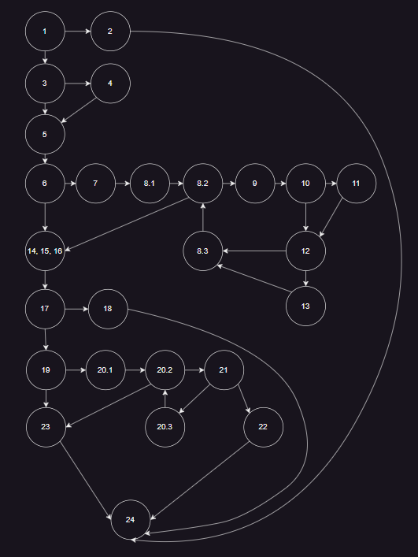
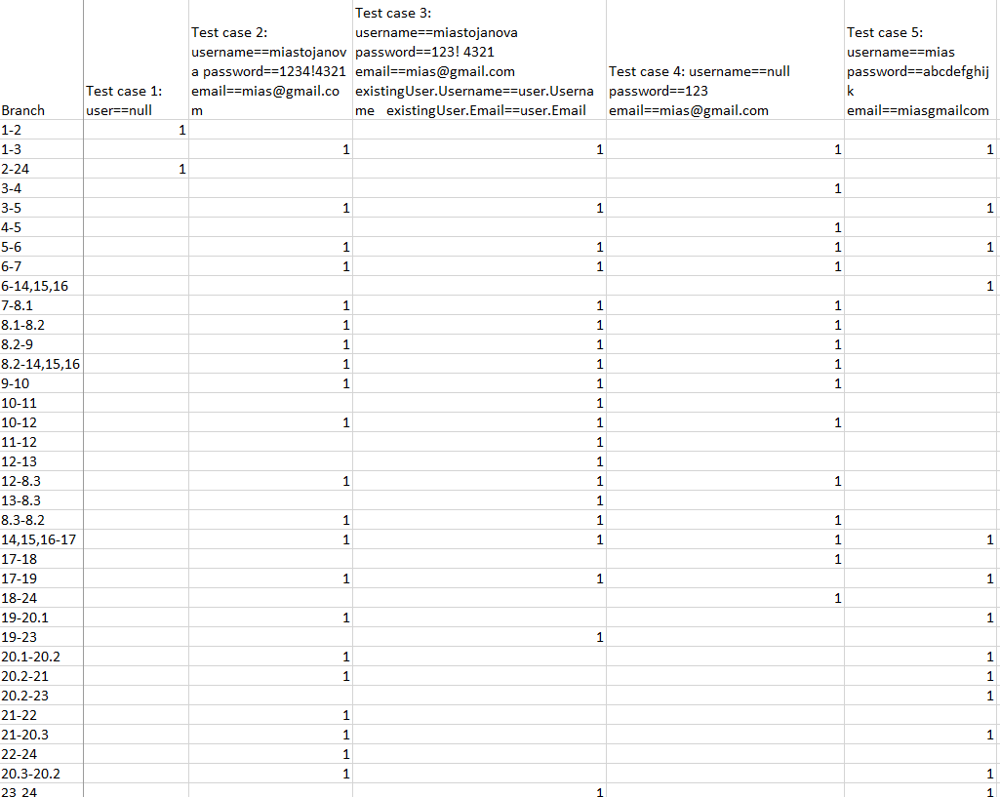
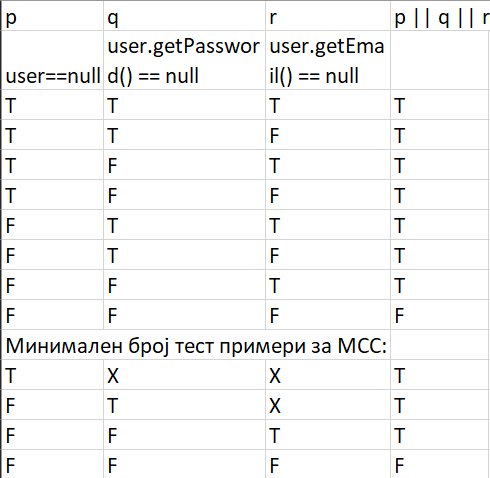

# SI_2023_lab2_213134

Миа Стојанова 213134

2.)

3.) Цикломатската комплексност е 11. Резултатот е добиен со броење на сите предикатни јазли (во случајов 10 - 8 if-ови и 2 for услови 8.2 и 20.2) и додавање +1.

4.)
- Test case 1 каде што вредноста на user е null при што го поминува само првиот if 
- Test case 2 каде што има валиден username, password со повеќе од 8 карактери и специјален знак, email со @ и . и да не постои ист корисник
- Test case 3 каде што пареметрите за user се речиси исти како во вториот тест, само password содржи празно место, и додатно да постои еден ист корисник во листата allUsers
- Test case 4 username да има вредност null и да има помалку од 8 каректери во password
- Test case 5 без специјален занк во password

5.)
На сликата се дадени сите test cases според MC критериумот (доколку секои од параметрите имаат или немаат null вредност) како и минималниот бтој на потребни тест случаи.

